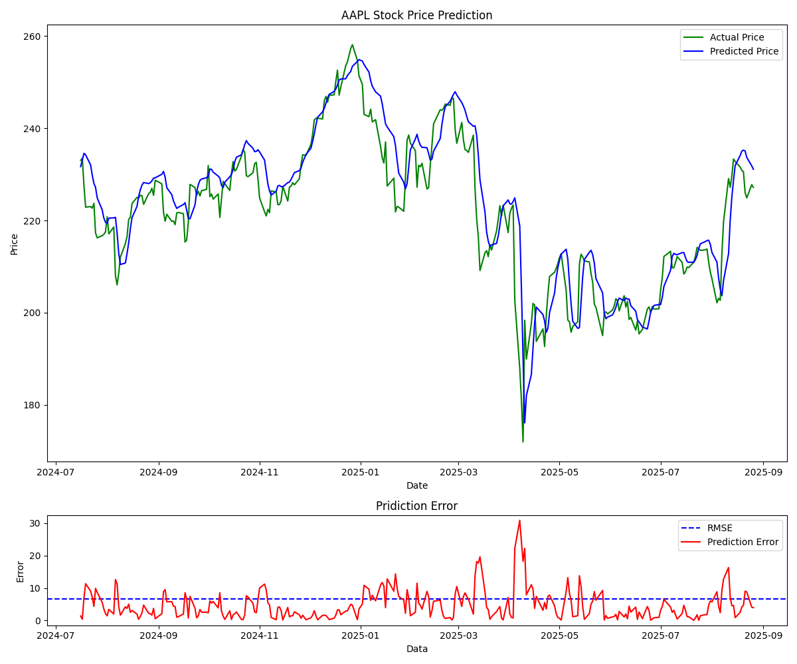

# Stock Price Prediction Using LSTM 📈

## Overview

This project is implementation of a **Stock Price Prediction** model using a **Long Short-Term Memory (LSTM)** neural network. The goal of this project is to apply fundamental data science, machine learning, and financial data analysis skills to forecast stock prices. The model is built using **PyTorch** and leverages various Python libraries for data manipulation, visualization, and preprocessing.

---

## Key Features

* **Data Acquisition**: Automatically downloads historical stock data using the **`yfinance`** library.
* **Data Preprocessing**: Utilizes **`scikit-learn`**'s `StandardScaler` to normalize the data, a crucial step for neural network training.
* **Sequential Data Handling**: Structures time-series data into appropriate sequences for LSTM input.
* **Model Architecture**: Implements a custom LSTM model using **`PyTorch`'s `nn.Module`** for training and prediction.
* **Training & Evaluation**: Trains the model on historical data and evaluates its performance on unseen data.
* **Visualization**: Creates visualizations using **`matplotlib`** to compare actual vs. predicted stock prices.

---

## Technologies & Libraries Used

This project utilizes the following key libraries:

* **`yfinance`**: For downloading historical stock market data.
* **`numpy`**: For numerical operations, especially with arrays.
* **`pandas`**: For data manipulation and analysis, primarily for handling the stock data in a DataFrame format.
* **`matplotlib`**: For data visualization.
* **`scikit-learn`**: For data preprocessing, specifically scaling.
* **`pytorch`**: For building, training, and evaluating the LSTM model.

---

## Installation & Setup

1.  **Clone the Repository**:
    ```bash
    git clone https://github.com/KrishnaG-101/Stock-Price-Prediction-Using-LSTM.git
    cd Stock-Price-Prediction-Using-LSTM
    ```

2.  **Install Dependencies**:
    It is recommended to use a virtual environment.
    ```bash
    pip install numpy pandas matplotlib scikit-learn yfinance torch
    ```

3.  **Run the Project**:
    Execute the main notebook to run the entire process, from data fetching to visualization.

---

## Project Structure

Your project should be structured somewhat like this:
.
├── AAPL_stock_price.png
├── AAPL_stock_price_prediction.png
├── LICENSE
├── README.md
└── Stock_Price_Prediction_Using_LSTM.ipynb

---

## How It Works

1.  **Data Ingestion**: The script first uses `yfinance` to download historical stock data (e.g., for **`AAPL`**, **`MSFT`**, etc.).
2.  **Data Preprocessing**: The **`Close`** price is extracted and then scaled using `StandardScaler`. This transforms the data to have a mean of 0 and a standard deviation of 1.
3.  **Sequence Creation**: The scaled data is then converted into sequential input-output pairs suitable for an LSTM, where a sequence of previous prices is used to predict the next price.
4.  **Model Definition**: A `PredictionModel` class is created, inheriting from `torch.nn.Module`, to define the LSTM layers and a final linear layer for output.
5.  **Training**: The model is trained on the training dataset using a specified number of epochs, with a loss function (e.g., Mean Squared Error) and an optimizer (e.g., Adam).
6.  **Prediction & Visualization**: After training, the model predicts stock prices on the test dataset. The results are then un-scaled and plotted against the actual prices to visually assess the model's performance.

---

## Results



---

## Future Enhancements

* Experiment with different LSTM architectures (e.g., adding more layers or dropout).
* Incorporate other features like Volume, High, and Low prices into the model's input.
* Hyperparameter tuning (e.g., learning rate, number of epochs, sequence length).
* Implement real-time stock data fetching and prediction.

---

## License

This project is licensed under the MIT License.
